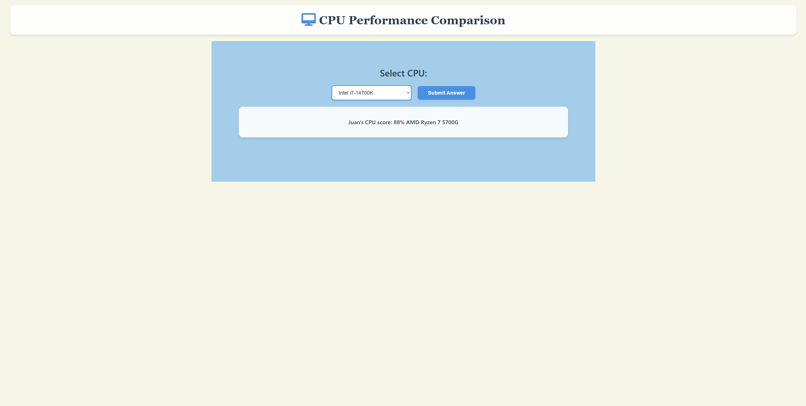
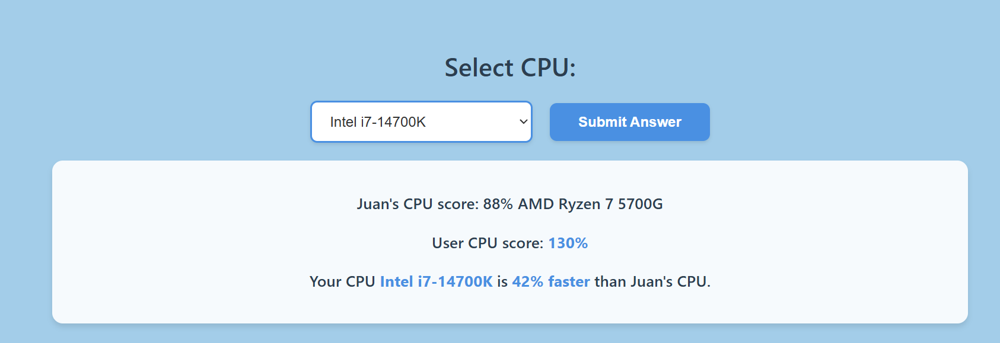

# CPU Performance Comparison

CPU Performance Comparison is an interactive web application that helps users compare CPU performance scores in a simple and intuitive way. The site is targeted toward PC enthusiasts, gamers, and anyone building or upgrading their computer who wants to understand how different processors stack up against Juan's CPU. CPU Performance Comparison will be useful for users to make informed decisions about CPU purchases by seeing real performance data and direct comparisons.

## Features

This section describes the different parts of the project and the value each feature provides for users who want to compare CPU performance quickly and easily.

### Existing Features

#### Interactive Header with Desktop Icon

- Featured at the top of the page, the header includes a modern Font Awesome desktop computer icon and the site title with a clean, professional serif font.
- The header uses a card-like design with rounded corners and subtle shadow, creating a modern and polished appearance.
- This section immediately communicates the purpose of the site and establishes visual hierarchy.

#### CPU Selection Dropdown

- The dropdown menu is dynamically populated with available CPU options from the userCPU object, ensuring the list can be easily updated.
- Features modern styling with blue borders, rounded corners, hover effects, and smooth transitions.
- Users can easily browse through CPU options and select the processor they want to compare against Juan's CPU.

#### Submit Button

- A prominent, modern-styled button with blue background and white text invites user interaction.
- Includes hover effects with a subtle lift animation and focus states for accessibility.
- When clicked, the button triggers the comparison calculation and reveals the results.

#### Dynamic Results Display

- Results are hidden by default and only appear after the user submits their CPU choice, following the progressive disclosure pattern.
- Displays three key pieces of information:
  - User's CPU score (percentage)
  - Selected CPU name and performance difference
  - Whether the selected CPU is faster or slower than Juan's CPU
- Uses modern typography with the Segoe UI font family and blue highlighting for important data points.
- Results are presented in a white card with rounded corners and shadow for visual separation.

#### Responsive Design

- The site adapts seamlessly to different screen sizes using CSS media queries.
- On tablets (up to 900px), font sizes and container widths are adjusted for optimal readability.
- On mobile devices (up to 600px), the layout expands to full width and the logo size is reduced for better space utilization.
- All interactive elements remain easily clickable on touch devices.

#### Reference CPU Display

- Juan's CPU score (88% AMD Ryzen 7 5700G) is always visible, providing a consistent benchmark for comparison.
- This helps users understand the context of their comparison results immediately.

### Features Left to Implement

- **GPU Comparison**: Add graphics card performance comparison alongside CPU comparison.
- **Performance Charts**: Visual bar charts or graphs to show performance differences more intuitively.
- **Multiple Comparisons**: Allow users to compare multiple CPUs side-by-side.
- **User History**: Save previous comparisons using local storage.
- **Expanded CPU Database**: Include more CPU models from different generations and manufacturers.

## User Stories

### First Time Visitor Goals
1. As a first-time visitor, I want to quickly understand what the site does and how to use it.
2. As a first-time visitor, I want to easily select a CPU and compare its performance.
3. As a first-time visitor, I want to see clear performance metrics and understand if my CPU is better or worse.

### Returning Visitor Goals
1. As a returning visitor, I want to compare different CPUs quickly without confusion.
2. As a returning visitor, I want the site to work seamlessly on my mobile device.

### Site Owner Goals
1. As the site owner, I want to provide accurate CPU performance comparisons.
2. As the site owner, I want the site to be accessible and responsive on all devices.
3. As the site owner, I want clean, maintainable code that follows best practices.

## Wireframes

All wireframes and screenshots are located in the `documentation` folder:
- `responsive-mockup.png` - Multi-device mockup
- `header.png` - Header section design
- `dropdown.png` - CPU selection dropdown
- `button.png` - Submit button design
- `results.png` - Results display section

## Testing

The project has been thoroughly tested to ensure all features work as intended across different browsers and devices.

### Manual Testing

#### Test Case 1: Page Load
**User Story**: As a first-time visitor, I want to quickly understand what the site does.

| Action | Expected Result | Actual Result | Pass/Fail |
|--------|----------------|---------------|-----------|
| Navigate to site | Page loads with heading, dropdown, and submit button visible | Page loads correctly with all elements | Pass |
| Check dropdown | Dropdown is populated with CPU options | All 6 CPU options display correctly | Pass |
| Check results section | Results are hidden until submission | Only Juan's score visible, user results hidden | Pass |

#### Test Case 2: CPU Selection and Comparison
**User Story**: As a first-time visitor, I want to easily select a CPU and compare its performance.

| Action | Expected Result | Actual Result | Pass/Fail |
|--------|----------------|---------------|-----------|
| Click dropdown | Dropdown opens showing CPU list | Dropdown opens with 6 options | Pass |
| Select "Intel i7-14700K" | Option is selected | Intel i7-14700K is selected | Pass |
| Click Submit Answer | Results appear showing score and comparison | Results display: 130%, faster by 42% | Pass |
| Select "AMD R3-5300G" | New results show | Results display: 77%, slower by 11% | Pass |

#### Test Case 3: Results Display
**User Story**: As a first-time visitor, I want to see clear performance metrics.

| Action | Expected Result | Actual Result | Pass/Fail |
|--------|----------------|---------------|-----------|
| Submit with fast CPU | Shows "faster" and percentage difference | Correctly shows "faster" with accurate % | Pass |
| Submit with slow CPU | Shows "slower" and percentage difference | Correctly shows "slower" with accurate % | Pass |
| Check score format | Scores display with % symbol | All scores show % correctly | Pass |

#### Test Case 4: Responsive Design
**User Story**: As a returning visitor, I want the site to work on my mobile device.

| Action | Expected Result | Actual Result | Pass/Fail |
|--------|----------------|---------------|-----------|
| View on mobile (375px) | Layout adjusts, elements are readable | Full-width layout, text readable | Pass |
| View on tablet (768px) | Layout adjusts appropriately | Container width adjusts, fonts resize | Pass |
| View on desktop (1920px) | Optimal spacing and layout | Clean layout with proper spacing | Pass |
| Interact on touch device | Buttons and dropdown are easily tappable | All elements easily tappable | Pass |

#### Test Case 5: Interactive Elements
**User Story**: As a user, I want smooth, intuitive interactions.

| Action | Expected Result | Actual Result | Pass/Fail |
|--------|----------------|---------------|-----------|
| Hover over submit button | Button shows hover effect (lift, color change) | Smooth hover animation works | Pass |
| Hover over dropdown | Border color changes, shadow appears | Hover effects work correctly | Pass |
| Focus on dropdown (keyboard) | Focus state with blue outline appears | Focus state displays correctly | Pass |
| Focus on button (keyboard) | Focus state with blue outline appears | Focus state displays correctly | Pass |

### Feature Testing

- **CPU Dropdown**: Successfully populates with all CPU options on page load. Selection changes are correctly captured.
- **Submit Button**: Triggers the comparison function and reveals hidden results. All hover and focus states work correctly.
- **Score Calculation**: Correctly retrieves CPU scores from the userCPU object and displays them with percentage symbols.
- **Difference Calculation**: Accurately calculates the absolute difference between selected CPU and reference CPU.
- **Faster/Slower Logic**: Correctly determines and displays whether the selected CPU is faster or slower.
- **Progressive Disclosure**: Results remain hidden until the submit button is clicked, then smoothly appear.
- **Responsive Behavior**: Layout adapts correctly on desktop (1920px), tablet (768px), and mobile (375px) screen sizes.

### Browser Compatibility

The site has been tested on:
- Google Chrome (latest version)
- Mozilla Firefox (latest version)
- Microsoft Edge (latest version)
- Safari (latest version)

All features work consistently across these browsers.

### Responsive Testing

- **Desktop (1920x1080)**: All elements display with proper spacing, readable text, and intuitive layout.
- **Tablet (768x1024)**: Container width adjusts, font sizes reduce appropriately, all interactive elements remain accessible.
- **Mobile (375x667)**: Full-width layout, optimized font sizes, logo scales down, all functionality preserved.

### Code Quality

- **DOM Caching**: All frequently accessed DOM elements are cached at the top of the script for better performance.
- **Event Listeners**: Properly attached and functional without memory leaks.
- **Progressive Enhancement**: Core functionality works even if JavaScript fails to load initially.

### Validator Testing

#### HTML
- No errors were returned when passing through the official [W3C validator](https://validator.w3.org/)

#### CSS
- No errors were found when passing through the official [(Jigsaw) validator](https://jigsaw.w3.org/css-validator/)

#### JavaScript
- Code follows best practices with proper variable naming, DOM caching, and modern ES6 syntax.

### Unfixed Bugs

No known bugs at this time. All features work as intended across all tested browsers and devices.

## Deployment

The site was deployed to GitHub Pages. The steps to deploy are as follows:

1. In the GitHub repository, navigate to the Settings tab
2. From the left sidebar, select "Pages"
3. From the source section drop-down menu, select the Main Branch
4. Once the main branch has been selected, the page will be automatically refreshed with a detailed ribbon display to indicate the successful deployment

The live link can be found here - [https://juanakas.github.io/code_institute_milestone_2/](https://juanakas.github.io/code_institute_milestone_2/)

### Local Deployment

To run this project locally:

1. Clone the repository: `git clone https://github.com/Juanakas/code_institute_milestone_2.git`
2. Navigate to the project directory
3. Open `index.html` in your web browser

## Credits

### Content

- CPU performance scores are based on general performance benchmarks and are for demonstration purposes.
- The concept and implementation of DOM caching for performance optimization was inspired by JavaScript best practices from [MDN Web Docs](https://developer.mozilla.org/).
- Progressive disclosure pattern implementation guidance from modern UX design principles.

### Media

- The desktop computer icon is from [Font Awesome](https://fontawesome.com/) (Free tier).
- Font Awesome CDN v6.5.1 is used for icon rendering.

### Code

- Modern CSS styling techniques including card designs, hover effects, and transitions follow contemporary web design standards.
- JavaScript DOM manipulation and event handling follow ES6+ best practices.
- Responsive design media queries follow mobile-first design principles.

### Acknowledgments

- Font families: Georgia (serif) for headings, Segoe UI (sans-serif) for body text - both system fonts for optimal performance.
- Color scheme: Professional blue (#4a90e2) for interactive elements, dark gray (#2c3e50) for text content.

---

## Technologies Used

- **HTML5**: Semantic markup for structure
- **CSS3**: Modern styling with Flexbox, animations, and media queries
- **JavaScript (ES6+)**: Interactive functionality and DOM manipulation
- **Font Awesome**: Icon library for desktop computer icon
- **Git**: Version control
- **GitHub**: Code hosting and deployment via GitHub Pages
